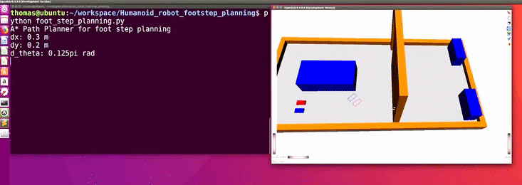

# Foot Step Planning Based on A \* algorithm
In this project, we proposed an online footstep planning algorithm for a humanoid robot. The algorithm plans an optimal (and collision free) step sequence for a humanoid robot to walk to the target location. In the below simulation, the red rectangle represents the left foot and the blue represents the right foot. 




## Required packages:
 - Openrave
 - Python 2.7
 
 ## Instruction
run 
```python
 python foot_step_planning.py
```
